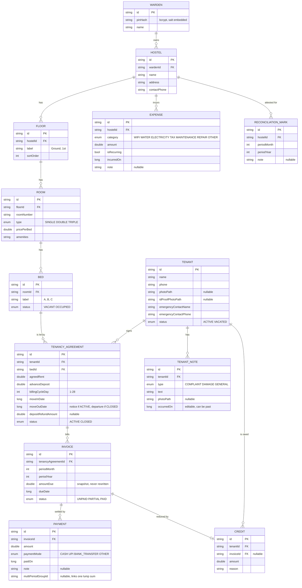
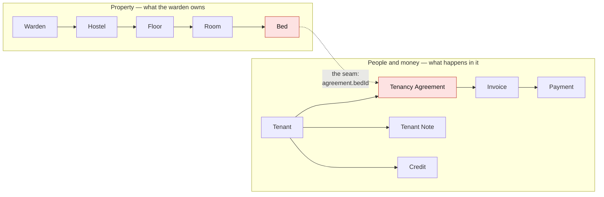
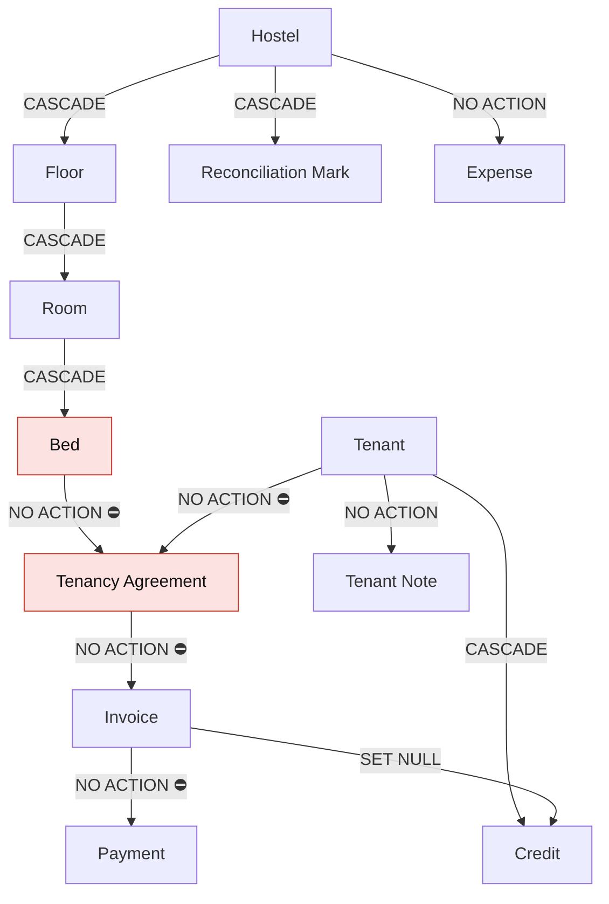

# Lodgy — Data Model

The Room/SQLite schema as built. Field lists and relationships here are taken
from the `@Entity` classes in `app/src/main/java/com/lodgy/app/data/entity/`,
not from the design intent — where the two ever disagree, the code is right and
this file is stale.

For *why* the model is shaped this way, see [`DESIGN.md`](DESIGN.md) §3.

Every table uses a UUID string primary key and carries `createdAt` / `updatedAt`
as epoch millis. Nothing is auto-increment, so a restored backup can never
collide with rows created on a fresh install — which is also what would make a
future sync layer feasible.

---

## 1. The whole schema

---

## 2. The two halves, and the seam between them

The schema is really two trees that meet at exactly one place.

`TenancyAgreement` is the join. It is a separate table from `Tenant` on purpose:
a returning tenant gets a second agreement rather than overwriting the first, so
their history survives a move-out and move-in. A bed transfer rewrites `bedId`
**on the same row** — no close-and-reopen — so one tenancy stays one tenancy and
its invoices stay attributed to it.

Because that seam exists, a tenant's hostel is not stored anywhere. It is derived:
`agreement → bed → room → floor → hostel`. Anything that needs to group tenants,
invoices or payments by property has to walk that join — which is why, for
example, the reconciliation badge on the invoice list resolves each invoice's
hostel per row.

---

## 3. Delete behaviour, and where it breaks

This is the part worth reading before adding any delete action.

The property tree cascades cleanly all the way down to `Bed`. It then **stops**:
`TenancyAgreement.bedId` is `NO ACTION`, as are `Invoice.tenancyAgreementId` and
`Payment.invoiceId`.

That asymmetry is deliberate — financial history must not vanish because someone
edited the property — but it means **a delete that removes a bed still referenced
by an agreement fails at the database, not in the UI**. With Room's foreign-key
enforcement on, SQLite raises `SQLITE_CONSTRAINT_FOREIGNKEY` and, if nothing
catches it, the app dies.

| Path | Guard today | Result |
|---|---|---|
| Delete a **room** with an occupied bed | Hard-blocked in `RoomListViewModel` | Safe |
| Delete a **floor** with an occupied bed | **None** | Crashes — LODGY-63 |
| Delete a **hostel** | No delete action exists | Would crash the same way — LODGY-64 |

So the rule for anything new: **block the delete in the ViewModel while a
descendant bed is still referenced by an agreement.** Do not rely on the cascade,
and do not catch the constraint after the fact — by then the warden has already
confirmed an action that cannot complete.

---

## 4. Notes on specific fields

- **`Invoice.amountDue` is a snapshot.** It is written once at generation and
  never rewritten, so a later rent change does not silently restate history.
  Reductions are recorded as a separate `Credit` row and applied on top, which is
  why every total is `invoice + credits` rather than a stored net figure.
- **`TenancyAgreement.moveOutDate` means two different things**, decided by
  `status`: notice given while `ACTIVE`, actual departure once `CLOSED`. Read it
  without the status and you will tell a warden that a current resident has left.
- **`Payment.multiPeriodGroupId`** is null for an ordinary payment. When one lump
  sum settles several months it is written across each resulting payment row, so
  the group can be recognised later without changing the one-payment-one-invoice
  shape.
- **`Bed.updatedAt` doubles as "vacant since"** — it is when the status last
  changed, which for a `VACANT` bed is when it was freed. The long-vacancy
  notification has nothing better to key on.
- **`Credit.invoiceId` is nullable and `SET NULL` on delete**, so a credit can be
  recorded against a tenant before the invoice it will offset exists.
